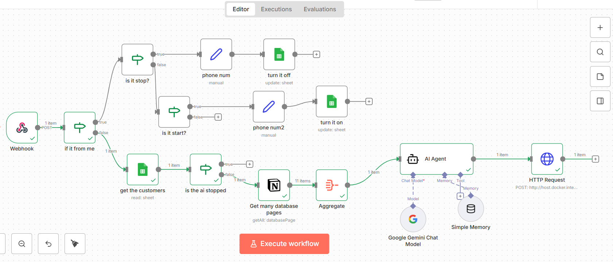

# 🎓 AI-Powered WhatsApp Assistant (Scholarships)

A self-hosted, full-stack automation system designed to handle student scholarship inquiries via WhatsApp. It utilizes **Google Gemini 1.5 Flash** for reasoning and integrates with **Notion** and **Google Sheets** as a dynamic knowledge base (RAG).



## ✨ Key Features

- **🧠 RAG System (Retrieval-Augmented Generation):** The AI Agent retrieves scholarship details (requirements, links, degrees) directly from a **Notion Database** to answer queries accurately without hallucination.
- **💾 Context Awareness:** Uses **Google Sheets** to store user data and conversation history, allowing the bot to remember previous interactions.
- **🤝 Human-in-the-Loop (Hybrid Mode):** Includes a manual takeover mechanism. You can stop the bot for a specific user using the command `#stop` and resume automation with `#start`.
- **💸 Zero Cost Architecture:** Built using **n8n** and **Waha (WhatsApp HTTP API)** running on Docker, eliminating monthly per-message fees associated with official APIs.

## 🛠️ Tech Stack

- **Orchestration:** [n8n](https://n8n.io/) (Self-hosted)
- **WhatsApp API:** [Waha](https://github.com/devlikeapro/waha) (Dockerized)
- **AI Model:** Google Gemini 1.5 Flash
- **Database:** Google Sheets (User State) & Notion (Knowledge Base)

## 🚀 How to Use This Template

### 1. Prerequisites
You need **Docker** installed on your machine or VPS.

### 2. Start WhatsApp API (Waha)
Run the following command to start the WhatsApp server:
```bash
docker run -it --rm -p 3000:3000 -e WHATSAPP_DEFAULT_ENGINE=NOWEB devlikeapro/waha

بما أنك نظفتي ملف الـ JSON، الآن جاء وقت "التلميع والعرض" على GitHub.
هذه الخطوة هي التي ستحول الكود من مجرد ملف في جهازك إلى مشروع هندسي يراه العالم.
إليك الخطوات العملية لرفع المشروع الآن:
1. تجهيز "لقطة الشاشة" (Screenshot) 📸
قبل ما ترفعي، افتحي n8n وخذي صورة واضحة للشبكة المعقدة (Workflow) كاملة.
هذه الصورة هي أهم شيء في الريبوزيتوري لأن الناس (والمدراء) يحبون رؤية "حجم التعقيد" والأسلاك.
سميها workflow-diagram.png.
2. إنشاء المستودع (Create Repository) 📦
ادخلي حسابك في GitHub.
اضغطي علامة (+) في الزاوية العلوية واختاري New repository.
Repository name: اكتبي اسماً احترافياً، مثلاً:
AI-WhatsApp-Scholarship-Assistant
Description: اكتبي وصفاً قصيراً:
Full-stack WhatsApp automation using n8n, Docker, and Google Gemini with RAG capabilities.
اختاري Public.
ضعي علامة ✅ على Add a README file.
اضغطي Create repository.
3. رفع الملفات (Upload) 📤
في صفحة الريبوزيتوري الجديدة، اضغطي Add file > Upload files.
اسحبي الملفين:
ملف الـ JSON النظيف (scholarship_bot_template.json).
صورة المخطط (workflow-diagram.png).
انزلي تحت واضغطي الزر الأخضر Commit changes.
4. تزيين الواجهة (README.md) 📝✨
هذا الملف هو "وجه المشروع". سأعطيك كوداً جاهزاً ومنسقاً بشكل احترافي، ما عليك إلا نسخه ولصقه.
في صفحة الريبوزيتوري، اضغطي على أيقونة قلم الرصاص (Edit) بجانب ملف README.md.
امسحي الكلام الموجود، والصقي هذا الكود كاملاً:
code
Markdown
# 🎓 AI-Powered WhatsApp Scholarship Assistant

A self-hosted, full-stack automation system designed to handle student scholarship inquiries via WhatsApp. It utilizes **Google Gemini 1.5 Flash** for reasoning and integrates with **Notion** and **Google Sheets** as a dynamic knowledge base (RAG).


## ✨ Key Features

- **🧠 RAG System (Retrieval-Augmented Generation):** The AI Agent retrieves scholarship details (requirements, links, degrees) directly from a **Notion Database** to answer queries accurately without hallucination.
- **💾 Context Awareness:** Uses **Google Sheets** to store user data and conversation history, allowing the bot to remember previous interactions.
- **🤝 Human-in-the-Loop (Hybrid Mode):** Includes a manual takeover mechanism. You can stop the bot for a specific user using the command `#stop` and resume automation with `#start`.
- **💸 Zero Cost Architecture:** Built using **n8n** and **Waha (WhatsApp HTTP API)** running on Docker, eliminating monthly per-message fees associated with official APIs.

## 🛠️ Tech Stack

- **Orchestration:** [n8n](https://n8n.io/) (Self-hosted)
- **WhatsApp API:** [Waha](https://github.com/devlikeapro/waha) (Dockerized)
- **AI Model:** Google Gemini 1.5 Flash
- **Database:** Google Sheets (User State) & Notion (Knowledge Base)

## 🚀 How to Use This Template

### 1. Prerequisites
You need **Docker** installed on your machine or VPS.

### 2. Start WhatsApp API (Waha)
Run the following command to start the WhatsApp server:
```bash
docker run -it --rm -p 3000:3000 -e WHATSAPP_DEFAULT_ENGINE=NOWEB devlikeapro/waha

### 3. Import Workflow to n8n
Download the scholarship_bot_template.json file from this repository.
Open your n8n dashboard and select "Import from File".
Connect your Credentials:
Google Sheets: For user data tracking.
Notion: For scholarship data.
Google Palm (Gemini): For the AI model.
Update the HTTP Request node with your Waha API Key.
## 🔄 Logic Overview
Inbound Message: Webhook receives the WhatsApp message.
Sender Check: Determines if the message is from the User or the Admin.
If Admin: Checks for #stop or #start commands to update user status in Sheets.
Status Check: Checks Google Sheets to see if the user is stopped (Human mode) or active (Bot mode).
Data Retrieval: Fetches scholarship details from Notion + User context from Sheets.
AI Processing: Gemini generates a response based on the retrieved data.
Response: Sends the reply via Waha API.
